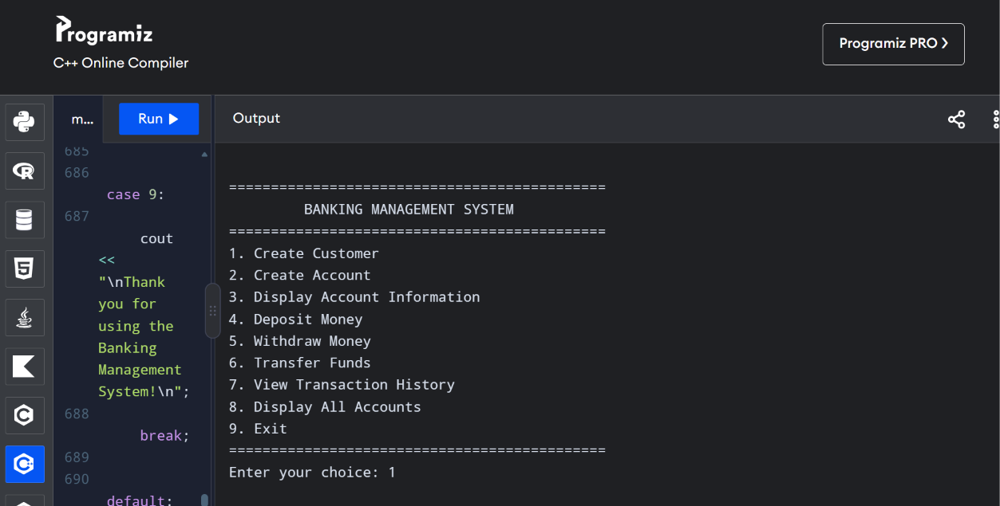
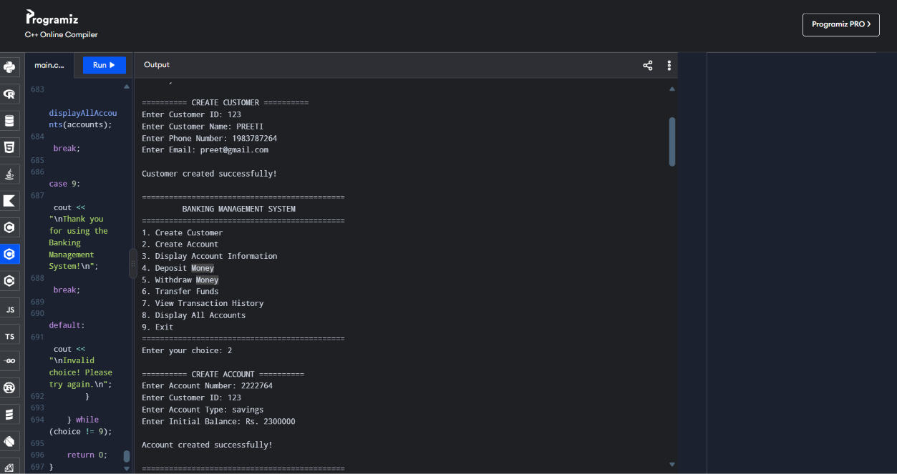
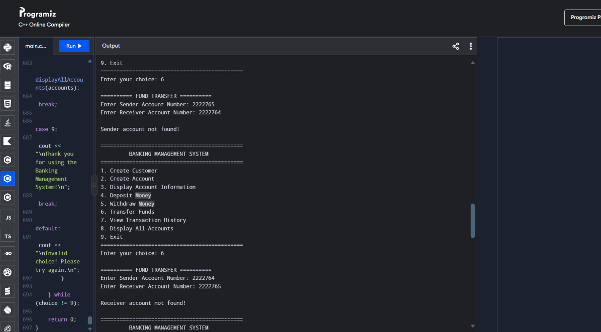
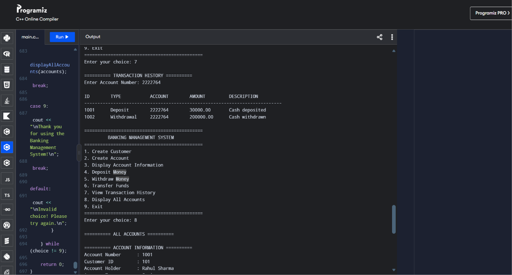

Great. Now let's do **FILE 2 — `README.md`** for Task 4.

Create this file here:

```text
CodeAlpha_Cpp_Internship/
└── Task4_Banking_System/
    └── README.md
```

Paste **exactly this** into `README.md`:

````markdown
# 🏦 Banking Management System

A console-based Banking Management System developed in C++ as part of the **CodeAlpha C++ Programming Internship – Task 4**.

The project demonstrates the use of **Object-Oriented Programming (OOP)** concepts to simulate essential banking operations such as customer management, account creation, deposits, withdrawals, fund transfers, and transaction history.

---

## 📌 Project Overview

The **Banking Management System** is a menu-driven C++ application designed to simulate basic banking activities through a simple console interface.

The application manages customers, bank accounts, and financial transactions using separate C++ classes.

Users can:

- Create customers
- Create bank accounts
- View account information
- Deposit money
- Withdraw money
- Transfer funds between accounts
- View transaction history
- Display all accounts

The system also includes validation to prevent invalid transactions such as negative amounts, duplicate account numbers, invalid accounts, and withdrawals exceeding the available balance.

---

## 🎯 Objectives

The main objectives of this project are:

- To implement a practical banking application using C++.
- To apply Object-Oriented Programming concepts.
- To create separate classes for customers, accounts, and transactions.
- To implement essential banking operations.
- To maintain accurate account balances.
- To record banking transactions.
- To implement input and transaction validation.
- To develop a structured menu-driven application.

---

## ✨ Key Features

### 👤 Customer Management

The system allows users to create customers with:

- Customer ID
- Name
- Phone number
- Email address

Duplicate Customer IDs are checked before creating a new customer.

---

### 🏦 Account Management

Users can create bank accounts linked to existing customers.

Each account contains:

- Account number
- Customer ID
- Account holder name
- Account type
- Current balance

Duplicate account numbers are not allowed.

---

### 💰 Deposit Money

Users can deposit money into an existing account.

The system:

1. Verifies the account.
2. Checks that the amount is positive.
3. Updates the account balance.
4. Creates a transaction record.
5. Displays the updated balance.

---

### 💸 Withdraw Money

Users can withdraw money from an account.

The system checks:

- Whether the account exists.
- Whether the amount is valid.
- Whether sufficient balance is available.

If all conditions are satisfied, the balance is updated and the transaction is recorded.

---

### 🔄 Fund Transfer

The system supports transferring money between two accounts.

The transfer process verifies:

- Sender account
- Receiver account
- Transfer amount
- Sender's available balance
- Different sender and receiver accounts

After a successful transfer, both account balances are updated.

---

### 📜 Transaction History

The system maintains transaction records containing:

- Transaction ID
- Transaction type
- Account number
- Amount
- Description

Users can view transaction history for a particular account.

---

### 📊 Account Information

Users can search for an account using its account number and view:

- Account number
- Customer ID
- Account holder
- Account type
- Current balance

---

### 📋 Display All Accounts

The system can display information for all available accounts in the application.

---

## 🧩 Object-Oriented Design

The project is organized around three main classes:

```text
                 BANKING SYSTEM
                       │
        ┌──────────────┼──────────────┐
        ↓              ↓              ↓
    Customer        Account       Transaction
        │              │              │
        ↓              ↓              ↓
 Customer Data    Bank Details    Transaction Data
````

### Customer Class

Responsible for storing customer information.

```text
Customer ID
Name
Phone
Email
```

### Account Class

Responsible for managing account information and balance.

```text
Account Number
Customer ID
Account Holder
Account Type
Balance
```

### Transaction Class

Responsible for storing transaction information.

```text
Transaction ID
Transaction Type
Account Number
Amount
Description
```

---

## 🛠️ Technologies Used

### Programming Language

**C++**

### Libraries

```cpp
#include <iostream>
#include <iomanip>
#include <vector>
#include <string>
#include <limits>
```

### Programming Concepts

* Object-Oriented Programming
* Classes and Objects
* Encapsulation
* Constructors
* Functions
* Vectors
* Loops
* Conditional Statements
* Searching
* Input Validation
* Menu-driven Programming

---

## 📂 Project Structure

```text
Task4_Banking_System/
│
├── README.md
│
├── src/
│   └── main.cpp
│
├── screenshots/
│   ├── dashboard.png
│   ├── account_creation.png
│   ├── deposit_withdrawal.png
│   ├── fund_transfer.png
│   └── transaction_history.png
│
└── docs/
    └── project_report.md
```

---

## ⚙️ How to Run

### 1. Clone the Repository

```bash
git clone https://github.com/YOUR-USERNAME/CodeAlpha_Cpp_Internship.git
```

### 2. Navigate to the Project

```bash
cd CodeAlpha_Cpp_Internship/Task4_Banking_System
```

### 3. Compile the Program

```bash
g++ src/main.cpp -o BankingSystem
```

### 4. Run the Program

#### Windows

```bash
BankingSystem.exe
```

#### Linux / macOS

```bash
./BankingSystem
```

---

## 🖥️ Application Menu

When the program starts, the following menu is displayed:

```text
=============================================
         BANKING MANAGEMENT SYSTEM
=============================================
1. Create Customer
2. Create Account
3. Display Account Information
4. Deposit Money
5. Withdraw Money
6. Transfer Funds
7. View Transaction History
8. Display All Accounts
9. Exit
=============================================
Enter your choice:
```

---

## 🧪 Sample Data

The program contains sample customer and account data for demonstration.

### Customer 1

```text
Customer ID : 101
Name        : Rahul Sharma
Phone       : 9876543210
Email       : rahul@gmail.com
```

Associated account:

```text
Account Number : 1001
Account Type   : Savings
Balance        : Rs. 10000
```

### Customer 2

```text
Customer ID : 102
Name        : Priya Patil
Phone       : 9876501234
Email       : priya@gmail.com
```

Associated account:

```text
Account Number : 1002
Account Type   : Savings
Balance        : Rs. 15000
```

These sample accounts make it possible to demonstrate deposits, withdrawals, and fund transfers immediately after starting the program.

---

## 🔐 Validation and Error Handling

The application includes validation for common banking errors.

### Customer Validation

* Duplicate Customer IDs are rejected.

### Account Validation

* Duplicate Account Numbers are rejected.
* Customer must exist before creating an account.
* Negative initial balances are rejected.

### Deposit Validation

* Account must exist.
* Deposit amount must be greater than zero.

### Withdrawal Validation

* Account must exist.
* Withdrawal amount must be greater than zero.
* Withdrawal cannot exceed the available balance.

### Transfer Validation

* Sender account must exist.
* Receiver account must exist.
* Sender and receiver cannot be the same.
* Transfer amount must be greater than zero.
* Sender must have sufficient balance.

---

## 📸 Screenshots

### Dashboard



The main menu provides access to all banking operations.

---

### Account Creation



Demonstrates customer and account creation.

---

### Deposit and Withdrawal


Demonstrates successful deposit and withdrawal operations with updated balances.

---

### Fund Transfer



Demonstrates transferring funds from one account to another.

---

### Transaction History



Displays recorded transactions associated with an account.

---

## 🚀 Future Scope

The current application is a console-based banking simulation. It can be further extended with:

* Database connectivity
* Graphical User Interface
* User authentication
* PIN/password protection
* ATM simulation
* Interest calculation
* Loan management
* Multiple account types
* Monthly account statements
* File-based data persistence
* Online banking functionality

---

## 📚 Documentation

Detailed information about the project, implementation, workflow, testing, and future improvements is available in:

```text
docs/project_report.md
```

---

## 👩‍💻 Author

**Preeti Choure**

**CodeAlpha C++ Programming Internship**

**Task 4 – Banking System**

---

## 🙏 Acknowledgement

This project was developed as part of the **CodeAlpha C++ Programming Internship** to apply C++ programming and Object-Oriented Programming concepts to a practical banking management system.

````

### ✅ After pasting

Your Task 4 should now look like:

Task4_Banking_System/
│
├── README.md          ✅ DONE
│
├── src/
│   └── main.cpp       ✅ DONE
│
├── screenshots/
│   └── (empty for now)
│
└── docs/
    └── (empty for now)
````

**Next is FILE 3: `docs/project_report.md`** — this will be the detailed documentation/report, so it will be longer than the README and will explain the project, classes, workflow, algorithms, validation, testing, learning outcomes, and conclusion.

